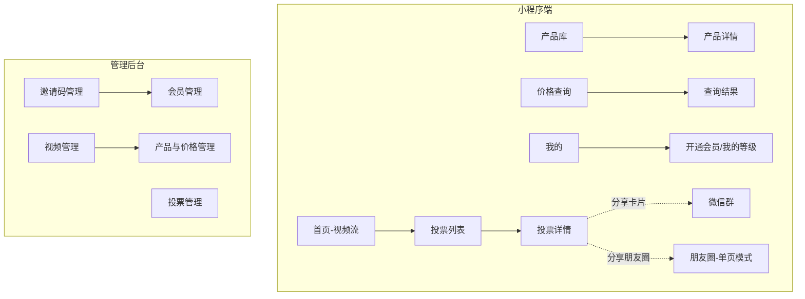

# 会员制产品小程序 需求文档（PRD）

创建日期：2026-09-24
状态：待评审

## 1 背景与目标

你作为品牌授权方/代理商，手握若干授权产品，下游是客户/经销商。目前产品资料、价格、新品意向沟通分散在私聊和朋友圈里，存在三个具体问题：价格按客户等级区分、不便公开张贴，每次询价都要人工回复；新品要不要拿货靠逐个私聊问，效率低、也没法汇总；视频号上积累的产品内容没有一个集中的展示入口。

这个小程序的定位是私域会员门户：只对受邀会员开放核心功能，把视频内容、产品库、分级查价、新品投票四件事收进一个入口。

目标（上线后 3 个月观察）：

- 80% 以上的常规询价通过小程序自助完成，私聊询价明显减少
- 新品投票参与率达到会员数的 50% 以上，替代人工逐个问
- 邀请码开通率可追踪，知道每个会员从哪来

## 2 角色定义

| 角色 | 说明 | 能做什么 |
|------|------|---------|
| 管理员（你） | 小程序拥有者 | 发邀请码、管会员和等级、管视频、管产品和价格、发投票、看数据 |
| 会员 | 你的客户/经销商，凭邀请码开通，分等级 | 看视频、浏览产品库、按编号查自己等级对应的价格、参与投票、分享投票 |
| 游客 | 未开通会员的微信用户（含被分享进来的） | 可看首页视频和被分享的投票页，不可见产品库和价格，可输入邀请码开通 |

会员等级默认分三级：普通 / 高级 / 核心，不同等级看到不同价格。等级名称和数量待你确认。

## 3 页面结构

小程序底部 5 个 Tab，另有一个管理后台（不对会员开放）。



## 4 功能需求

### 4.1 功能总览

| # | 模块 | 功能描述 |
|---|------|---------|
| 1 | 首页视频流 | 首条固定为小程序功能介绍视频（发布在管理员视频号，后台标记为首条置顶、可随时更换引用），其余位置展示从视频号挑选的视频，按后台排序展示。所有视频均通过官方组件内嵌引用视频号，不在小程序自托管。视频以卡片列表形式排列，点击全屏播放。游客和会员均可见。 |
| 2 | 登录与会员开通 | 用户打开小程序后微信授权登录（获取头像昵称）。未开通会员的用户在「我的」页输入邀请码，系统校验邀请码有效、未过期、未用完次数后开通会员，并绑定该邀请码预设的会员等级。邀请码无效时明确提示原因（不存在/已过期/已用完）。 |
| 3 | 会员等级与权限 | 会员等级分为普通/高级/核心三级（默认），等级只影响价格展示，不影响其他功能。管理员可在后台调整任意会员的等级、停用会员（停用后等同游客权限）。游客不可见产品库入口和价格信息。 |
| 4 | 产品库 | 展示当前授权产品，支持按分类筛选、按名称/编号搜索。列表项含图片、名称、编号、当前登录会员等级对应的价格。点击进入详情页，含多图、产品说明、编号、本等级价格。产品下架后对会员不可见。 |
| 5 | 价格查询 | 会员输入产品编号精确查询，结果显示产品图、名称、编号、当前用户等级对应的价格。编号不存在时提示「未找到该产品，请核对编号」；产品已下架时提示「该产品已下架」。游客进入此页时引导先去开通会员。 |
| 6 | 新品投票 | 管理员发布投票：关联一款新品（图片、名称、介绍），设置 2~4 个选项和截止时间。第一期只支持单选。每名会员对同一投票只能投一次，不可改票。投票后可见实时各选项占比；截止时间到自动停止投票，结果继续可见。 |
| 7 | 投票分享 | 投票详情页支持两种分享：转发到微信群（小程序卡片）、分享到朋友圈。朋友圈打开的用户处于单页模式，页面展示投票内容并引导「进入小程序参与投票」；非会员点击投票时提示需邀请码开通。分享出去的任何页面均不含价格信息。 |
| 8 | 我的 | 展示头像昵称、会员状态与等级。未开通时展示邀请码输入框；已开通时展示等级。提供「联系客服」入口（跳转企业微信客服或显示微信号，二选一，待确认）。 |

### 4.2 首页视频流（功能 1）

```text
┌───────────────────────┐
│ 品牌名 / Logo          │
│ ┌───────────────────┐ │
│ │ ▶ 功能介绍视频      │ │ ← 首条固定置顶，后台可更换引用
│ │   (引用视频号)       │ │
│ └───────────────────┘ │
│ ┌───────────────────┐ │
│ │ ▶ 视频号视频 1      │ │
│ │   标题 · 来自视频号  │ │
│ └───────────────────┘ │
│ ┌───────────────────┐ │
│ │ ▶ 视频号视频 2      │ │
│ └───────────────────┘ │
├───────────────────────┤
│ 首页  产品  查价  投票  我的 │
└───────────────────────┘
```

- 业务逻辑：首条固定为功能介绍视频，同样是视频号视频，由管理员在后台将其标记为「首条固定」，更换引用后所有用户下次进入即看到新视频；其余视频为管理员从视频号已发布内容中挑选的条目，按后台设置的顺序排列。
- 交互逻辑：点击视频卡片进入全屏播放；上滑返回列表。
- 规则约束：所有视频（含首条介绍视频）均需先发布到你的视频号。微信没有提供自动同步视频号列表的接口，管理员需登录视频号助手，在「动态管理」中复制每条视频的 feedId，粘贴到后台完成配置并排序，其中一条可标记为「首条固定」。小程序主体必须与视频号同主体或关联主体（基础库 2.31.1 起非个人主体可放宽到非同主体，但不建议依赖）。纯图片类型的视频号动态不支持内嵌。
- 边界与异常：视频号原视频被删除时，小程序内该条目显示「视频已失效」并允许管理员在后台移除；首条介绍视频失效或未配置时，首条位置不显示，不留空位。

### 4.3 开通会员（功能 2、3）

```text
┌───────────────────────┐
│  [头像]  微信昵称       │
│  状态：未开通会员        │
│ ┌───────────────────┐ │
│ │ 邀请码 [__________] │ │
│ │ [   开通会员   ]    │ │
│ └───────────────────┘ │
│  提示：邀请码请向管理员  │
│  索取                  │
└───────────────────────┘
```

- 业务逻辑：管理员后台生成邀请码时可设置绑定等级（普通/高级/核心）、有效期、可用次数（默认一码一用）、备注（记录发给谁）。用户提交邀请码后系统校验：存在、未过期、剩余次数大于 0，三项都通过则开通成功并绑定等级，同时扣减次数。
- 交互逻辑：开通成功后页面刷新为「等级：高级会员」状态，并弹出引导「去产品库看看」。
- 规则约束：邀请码为 8 位字母数字组合；同一微信账号只需开通一次，重复输入邀请码提示「你已是会员」。
- 边界与异常：邀请码错误提示具体原因；被停用的会员重新输入新邀请码可恢复，等级以新邀请码为准。

### 4.4 产品库与价格查询（功能 4、5）

```text
产品列表                        查价结果
┌───────────────────────┐  ┌───────────────────────┐
│ [搜索：名称 / 编号]     │  │ ┌───────────────────┐ │
│ 分类: 全部│A类│B类      │  │ │ 输入产品编号        │ │
│ ┌─────┐ ┌─────┐       │  │ │ [A-____] [ 查询 ]  │ │
│ │ 图  │ │ 图  │        │  │ └───────────────────┘ │
│ │名称 │ │名称 │        │  │ ─────────────────────│
│ │编号 │ │编号 │        │  │ [图] 产品名称         │
│ │¥会员价│ │¥会员价│      │  │ 编号：A-1024         │
│ └─────┘ └─────┘       │  │ 我的价格（高级）：¥xx  │
└───────────────────────┘  └───────────────────────┘
```

- 业务逻辑：每个产品在后台维护一套分等级价格表（普通价/高级价/核心价）。前端展示时根据当前登录会员的等级取对应价格，接口不返回其他等级价格，避免被抓取。
- 交互逻辑：查价页输入编号点查询，命中即显示结果卡片；列表页支持分类筛选和搜索，点击进详情。
- 规则约束：产品编号全局唯一，后台录入时校验重复；价格为必填，某等级价格未填时该等级会员看到「价格请咨询客服」。
- 权限逻辑：游客访问产品 Tab 和查价 Tab 时，显示引导页「开通会员后查看」，不提供任何产品数据。
- 边界与异常：编号不存在、产品已下架各有明确提示文案；会员被停用后访问这两个页面按游客处理。

### 4.5 新品投票（功能 6、7）

```text
投票详情
┌───────────────────────┐
│ 新品投票 · 截止 x月x日  │
│ ┌───────────────────┐ │
│ │     新品图片        │ │
│ └───────────────────┘ │
│ 新品名称 / 介绍文字     │
│ ○ 会上架，期待          │
│ ○ 观望，看价格再定       │
│ ○ 不感兴趣             │
│ [     投 票      ]     │
│ 投票后可查看各项占比     │
│ [ 发给群 ] [ 分享朋友圈 ]│
└───────────────────────┘
```

- 业务逻辑：管理员在后台创建投票（新品图文、选项、截止时间），发布后会员可见。每人限投一票、不可改；截止时间到自动停止接受投票。后台可查看投票明细（谁投了什么）和汇总占比，会员端只显示占比。
- 交互逻辑：未投票时选项可点选、底部按钮为「投票」；已投票时选项变为占比条形展示，按钮消失；已截止时展示「投票已结束」和最终结果。
- 分享逻辑：「发给群」生成小程序卡片；「分享朋友圈」进入朋友圈单页模式，页面只读展示投票内容和「进入小程序参与投票」引导按钮。
- 边界与异常：非会员（含朋友圈点进来的游客）点击投票时弹窗提示「投票仅限会员，请输入邀请码开通」；投票已截止时投票按钮置灰。

## 5 管理后台需求

后台形态建议先用微信云开发自带的内容管理（CMS）能力，够用且省开发量；如果后续操作频繁再升级为独立 Web 后台。此项待确认。

| 模块 | 功能点 |
|------|--------|
| 邀请码管理 | 生成（设等级/有效期/次数/备注）、列表查看使用状态、作废 |
| 会员管理 | 会员列表（昵称、等级、开通时间、来源邀请码备注）、调整等级、停用/恢复 |
| 视频管理 | 配置视频号视频（粘贴 feedId）、排序、将其中一条标记为首条固定介绍视频；移除失效视频 |
| 产品管理 | 产品增删改（图片、名称、编号、分类、介绍）、上架/下架 |
| 价格管理 | 每个产品维护普通/高级/核心三档价格，支持批量导入（Excel 模板） |
| 投票管理 | 创建投票（新品图文、选项、截止时间）、提前截止、查看明细与汇总 |

## 6 关键约束与风险

- 视频类目资质：所有视频均通过官方 `channel-video` 组件引用视频号，同主体下官方口径无需文娱类目，个人主体小程序也可用（小程序与视频号同主体即可）。剩余风险：若审核认定视频播放是小程序的主要内容，仍可能要求补「文娱-其他视频」类目（社区有实际案例），概率较低；如遇驳回，降级方案是视频条目改为跳转视频号观看（`wx.openChannelsActivity`，无主体与类目限制）。
- 邀请制与审核：纯邀请制小程序在微信审核时可能被要求提供体验方式，提交审核时需在后台生成一个测试邀请码提供给审核人员，并在审核说明里解释邀请制逻辑。
- 朋友圈分享限制：小程序分享朋友圈后，用户打开时处于单页模式，无法直接跳转其他页面，必须靠「进入小程序」引导按钮，投票转化率会受影响，文案引导要明显。
- 价格保密：价格接口只返回当前用户等级价格；投票分享卡片和朋友圈页面不出现任何价格；建议后台操作保留日志，记录谁在什么时间改过价格。
- 合规边界：会员等级仅用于区分价格，不要叠加「邀请返利、下线提成」之类的机制，否则可能触发微信对多级分销的违规判定。

## 7 里程碑

1. 需求确认（本文档评审通过，待确认事项全部收口）
2. UI 设计稿确认
3. 注册小程序、完成与视频号的主体关联（与开发并行）
4. 开发（小程序端 + 管理后台）
5. 内部测试：用 3 个不同等级账号验证价格隔离、邀请码全流程、投票分享链路
6. 提交微信审核（附测试邀请码和审核说明）
7. 小范围邀请种子会员试用，收集反馈后正式发布

## 8 待确认事项

| # | 事项 | 默认假设（不回复则按此执行） |
|---|------|------------------------------|
| 1 | 会员等级数量与名称 | 三级：普通 / 高级 / 核心 |
| 2 | 会员有效期 | 长期有效，管理员可停用 |
| 3 | 投票是否支持多选 | 第一期仅单选 |
| 4 | 管理后台形态 | 云开发 CMS |
| 5 | 游客可见范围 | 可见首页视频和投票，不可见产品与价格 |
| 6 | 联系客服方式 | 显示微信号，引导添加 |
| 7 | 是否需要消息通知（如投票结束提醒、新品上架提醒） | 第一期不做 |

已确认：视频全部引用视频号，介绍视频发布到视频号后首条固定引用（2026-09-24）。
